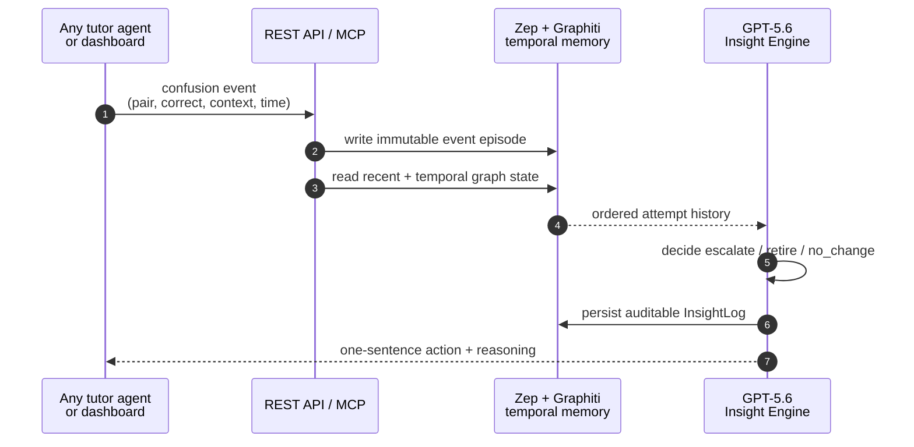

# Adaptive Memory for Tutors

A pluggable temporal-memory insight layer for tutoring agents. Built for **OpenAI Build Week 2026** (Education track), using **Codex** for development and **GPT-5.6** for the reasoning layer.

> This is not a tutoring app. It's the memory + insight layer underneath one. Plug it into any existing or custom-built tutor agent to give it persistent, temporal understanding of *what a student keeps confusing* and *whether they're improving* — something even Khanmigo and Duolingo's LLM tutoring layers don't yet do (they remain largely reactive, without a persistent model of the learner's progress).

Full rationale: [`docs/design_doc.md`](docs/design_doc.md)
Build plan / handover: [`docs/handover_doc.md`](docs/handover_doc.md)
Architecture diagram: [`docs/architecture.mermaid`](docs/architecture.mermaid)

---

## The memory handshake

One integration call turns an observed attempt into a durable, explainable
pedagogical action. The same flow works through the REST API or MCP tools.



**What the tutor builder gets:** persistent student-specific memory, a
point-in-time history, and one constrained action to drive the next tutor turn
— without building a graph database or adaptive engine.

---

## Quickstart (as a tutor builder)

1. Get an API key — demo key pre-loaded with seeded practice history (see `engine/seed.py`).
2. Point your agent at our MCP server: `mcp.yourapp.dev` *(placeholder — update once deployed)*.
3. Call `log_confusion_event` whenever your tutor sees a student mix up two concepts.
4. Call `get_insight_state` before generating your next drill — it tells you what to emphasize and why.

Or use the REST API directly:

```bash
curl -X POST https://api.yourapp.dev/v1/events \
  -H "Authorization: Bearer $API_KEY" \
  -H "Content-Type: application/json" \
  -d '{
    "tenant_id": "demo-school",
    "pair_id": "kana-so-n",
    "student_ref": "student-042",
    "correct": false,
    "context": "confused ソ for ン at end of word"
  }'

curl https://api.yourapp.dev/v1/insights/kana-so-n?student_ref=student-042 \
  -H "Authorization: Bearer $API_KEY"
```

## Local development

```bash
cp .env.example .env   # fill in ZEP_API_KEY and OPENAI_API_KEY
pip install -r requirements.txt
uvicorn api.rest.app:app --reload
```

Seed a demo student with synthetic practice history (guarded against accidental repeat runs — see the file for why this matters on a free-tier API budget):

```bash
python -m engine.seed --student demo-student-1 --domain japanese-kana
```

## What this is not

Not a curriculum, not a quiz bank, not a replacement for Duolingo/Khan Academy's adaptive-scoring engines — those already work well at their scale. This fills the gap between that scoring infrastructure and a proactive, cumulative LLM tutor layer, for builders who don't have Knewton-scale infrastructure of their own.

## Stack

- Memory substrate: [Zep Cloud](https://www.getzep.com) (Graphiti temporal knowledge graph) — managed, not self-hosted
- Insight reasoning: GPT-5.6
- API: FastAPI (REST) + MCP server
- Built with: Codex

## License

MIT — see [LICENSE](LICENSE).
